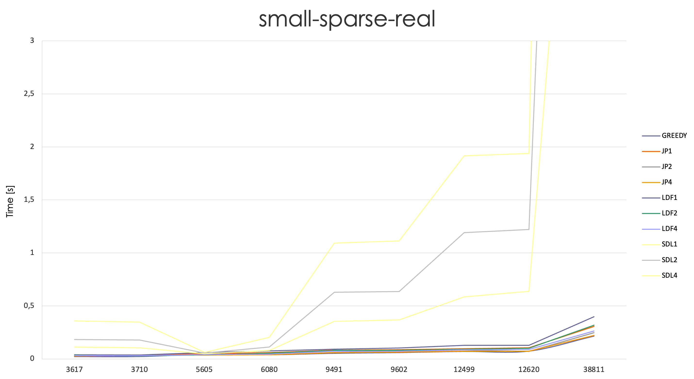
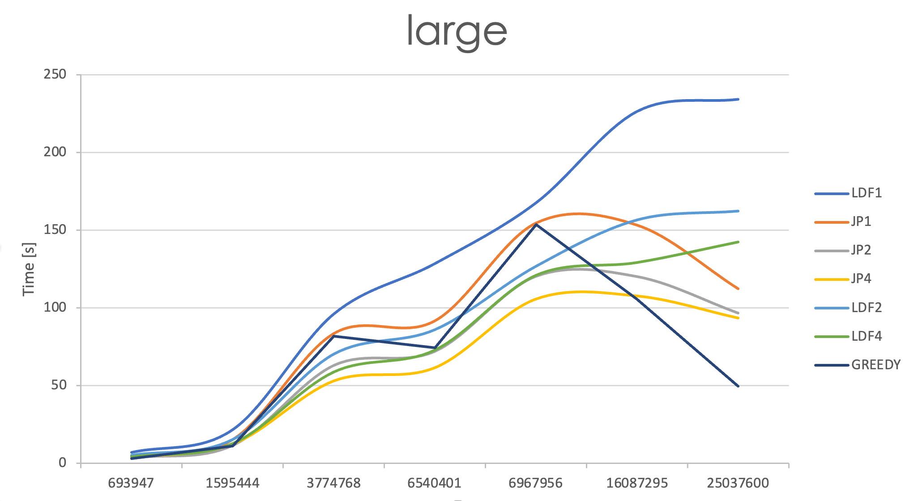

<h1>Parallel Graph Coloring</h1>

This project addresses the implementation of three parallel algorithms for graph coloring and compares them to a well-known sequential algorithm in terms of time and memory.

# Introduction to graph coloring
A graph is a structure consists of nodes called “Vertices” and links between these nodes called “Edges”. There are two main types of a graph, which are undirected graph and directed graphs, where an edge between 2 vertices has a direction.

Graph components such as vertex or edge can have a label and the process of assigning label to an edge or vertex is called “Graph Labeling” and a label is traditionally represented by an integer. In our project, we focus on vertex labeling only and the labels we are assigning are colors, then the process is called “Vertices Coloring” or generally “Graph Coloring”.

Graph Coloring is a well-known problem in the discrete mathematics field and its practical applications. It is a way to color the vertices of a graph in such a way that there are no two adjacent vertices have the same color. Therefore, there are many algorithms have been developed to solve this problem. Our Goal is to find the most appropriate on for a parallel environment.

In order to solve the problem of graph coloring in an efficient way, the parallel coloring is used by most of algorithms, which manipulate the multi-core ability of modern processors and multi-thread programming capabilities provided by operating systems to achieve higher performance.

Therefore, in this project, we implement a group of well-known graph-coloring algorithms to analyse and compare them with each other, to know the performance of each one compared to the other.

# Algorithms 

## Greedy

[Greedy](./GraphColoring/greedy.h) implements the simple, well-known greedy strategy described in the provided documentation. 
It is single-threaded, i.e. sequential algorithm which choses every iteration the local best solution.

## Jones Plassmann

[jonesPlassmann](./GraphColoring/jonesPlassman.h) implements the algorithm as described in *A Comparison of Parallel Graph Coloring Algorithms* of J. R. Allwright. 
At its core, Jones' algorithm defines a total ordering on the vertices, based on the highest random weight assigned to each vertex in the graph initialization, and then colors each node for which all uncolored neighbors have a lower weight.

*Implementation:* the random `weights` are generated once by a single thread. Each thread is then responsible for coloring the corresponding subset of vertices in the graph. A thread tries to color each vertex of its own partion, then check if the vertex color is unique among its neighbors and, if not, the vertex is added in a list of wrong colored vertices. The assumption is that there is a little number of conflicts of this type. After all vertices have been colored, the sequential coloring of wrong colored vertices is run. A drowback of this implementation is that not much parallelism is exploited.

## Largest Degree First (LDF)

[LDF](./GraphColoring/largestDegreeFirst.h) implements the algorithm described in J. R. Allwright, 1995. The algorithm uses the degree of vertices in the subsets of the graph to decide which vertex to be colored before the other(Largest degree is colored firstly).LDF exploits a different creterion of comparison between the vertices than Jones-Plassmann algorithm. Random weights are still used for defining the priority in case of two vertices with the saem degree. The approach in LDF is to use the least number of colors. 

*Implementation:* the implementation is the same of Jones-Plassmann, but in this case the comparison between the verteces is applied on the degrees, instead of the random weights.

## Smallest Degree Last (SDL)

[SDL](./GraphColoring/smallestDegreeLast.h) implements the algorithm from *A Comparison of Parallel Graph Coloring Algorithms*, J. R. Allwright, 1995.This algorithm uses degrees also like LDF. However, unlike LDF it uses also weights to decide which vertex to be colored first. The algorithm goes into two phases. The first phase is the weighting phase in which all vertices in the graph that have a degree equal to the smallest degree takes a weight equal the current weight (initially 0), then the graph is updated considering to the subgraph induced by the set of remaining vertices. This process is repeated many times until all vertices are assigned a weight. The second phase comes to color this groups starting from the largest weight to the smallest weight with the same strategy of the Jones-Plassmann algorithm.

*Implementation:* the weighting phase is run in parallel, each thread weights the assigned subset of vertices in the graph using an ausiliar vector of degrees to keep track of the graph induced by the subset of remaining vertices. The coloring phase is run in parallel as in the Jones-Plassmann implementation.  

# Benchmarking

For benchmarking purposes we save the results of the program in a csv file called [graph_coloring](./GraphColoring/graph_coloring.csv). In this file, for each directory of `benchmark`, we write:
- algorithm name
- number of threads
- number of vertices
- number of colors used
- execution time (in seconds)
- memory usage (in MB)
- success / unsuccess

We analysed the behavior of the parallel algorithms in case of 1,2 and 4 threads.

We choose two sub-directories (`sigmod08` and `small-sparse-real`) for creating graphs of our algorithms' implementation based on computation time at increasing number of vertices:
   
   

We also report the results obtained with the `large` folder running the two best-performing algorithms: `Jones-Plassmann` and `Largest-Degree-First` with different number of threads:

# Memory usage

The sequential algorithm and the three parallel algorithms have been tested in terms of memory usage. 

								
## Average memory usage per folder ( total memory usage / n_graphs )
| Graph             | Greedy | JP (1 thread) | JP (2 thread) | JP (4 thread) | LDF (1 thread) | LDF (2 thread) | LDF (4 thread) | SDL (1 thread) | SDL(2 thread) | SDL (4 thread) |
| :---------------- | :----: | :-----------: | :-----------: | :-----------: | :------------- | :------------: | :------------: | :------------: | :-----------: | :------------: |
| **sigmod08**          |    8,822MB   |   8,893MB           | 8,994MB   |      9,070MB         |     8,895MB	           |     8,996MB          |    9,07MB           |  8,945MB              |       8,989MB        |         9,059MB       |
| **small-sparse-real** |     9,169MB   |     9,259MB          |    9,341MB           |    9,426MB           |              8,459MB  |             9,341MB   |          9,426MB      |           9,296MB     |    9,336MB           |      9,415MB          |
| **large** |     1681 MB   |   1707 MB     |      1693 MB      |     1691 MB       |     1688 MB |  1694 MB   |     1692 MB       |    -    |    -      |    -     |

# Times 
      
# Conclusions
The multithread algorithms for graph coloring provided results comparable to the sequential greedy one on the considered graphs. The Smallest Degree Last algorithm provided the worst performances, maybe due to a bad implementation. However more recent and powerful algorithms could provide a true speedup on the performances in terms of elapsed time. The memory usage seems to be approximately the same for all the algorithms and grows significantly as the number of vertyices increases.
Different execution times strongly depend on the number of edges on the graphs and on their topologies as it's shown in the graphs, even with a greater number of vertices, the execution time can be lower if the nodes have few edges.

